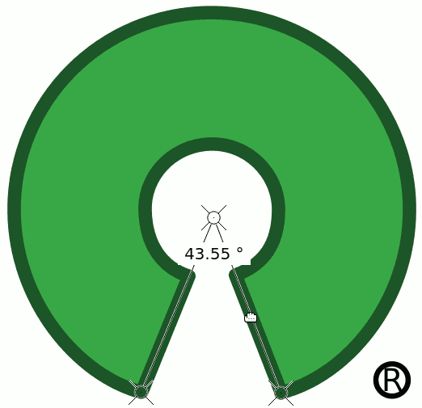

# pyqtprotractor
Multiplatform<sup>†</sup> protractor overlay tool for measuring angles on screen.

Probably easiest to run with `uv`.

```sh
$ uv run pyqtprotractor
```

<sup>†</sup> *Tested only on Linux so far, but since it is written in Python and Qt if should be able run on Windows and Mac as well.*

## Usage

Run `./protractor.py`. An overlay should appear in the top left corner of your screen, showing a 45 degree angle.

* You can move the individual points around by dragging them with the mouse.
* You can move the whole protractor around without changing the angle by dragging the lines or the angle text box.
* You can work "around" the protractor, for example click between the arms to draw something in the window below (unless you're using Gnome Wayland on Linux).

### Keyboard shortcuts

Probably broken on non-Linux platforms, but worth a try.

* `X` = toggle inverting angle around 180 degrees
* `N` = toggle allow negative values
* `Ctrl+C` = copy value
* `Ctrl+Shift+C` = copy value, rounded to nearest integer

## Example

Measuring the angles of the Open Source Initiative logo:



## License

This project is licensed under the MIT license.

```
Copyright (c) 2023 Fritz Webering

Permission is hereby granted, free of charge, to any person obtaining a copy
of this software and associated documentation files (the "Software"), to deal
in the Software without restriction, including without limitation the rights
to use, copy, modify, merge, publish, distribute, sublicense, and/or sell
copies of the Software, and to permit persons to whom the Software is
furnished to do so, subject to the following conditions:

The above copyright notice and this permission notice shall be included in all
copies or substantial portions of the Software.

THE SOFTWARE IS PROVIDED "AS IS", WITHOUT WARRANTY OF ANY KIND, EXPRESS OR
IMPLIED, INCLUDING BUT NOT LIMITED TO THE WARRANTIES OF MERCHANTABILITY,
FITNESS FOR A PARTICULAR PURPOSE AND NONINFRINGEMENT. IN NO EVENT SHALL THE
AUTHORS OR COPYRIGHT HOLDERS BE LIABLE FOR ANY CLAIM, DAMAGES OR OTHER
LIABILITY, WHETHER IN AN ACTION OF CONTRACT, TORT OR OTHERWISE, ARISING FROM,
OUT OF OR IN CONNECTION WITH THE SOFTWARE OR THE USE OR OTHER DEALINGS IN THE
SOFTWARE.
```
